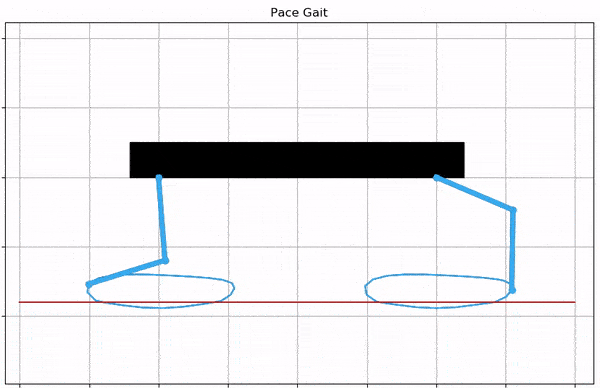

# DIPLOID -The Quadruped Robot

  
  

  
  

**Light Blue :** Left legs   **Dark Blue :** Right Legs

Various gaits implemented so far.

## Overview
This project is the source code for DIPLOID quadruped, a 4 legged robot. The software is implemented on a Raspberry Pi.

## Credits

* Original idea : MIT Cheetah and Spot by Boston Dynamics
* Spot Micro AI Community : https://spotmicroai.readthedocs.io/en/latest/
* Spot mini mini : {authors = Maurice Rahme and Ian Abraham and Matthew Elwin and Todd Murphey} [spotminimini2020github](https://github.com/moribots/spot_mini_mini)