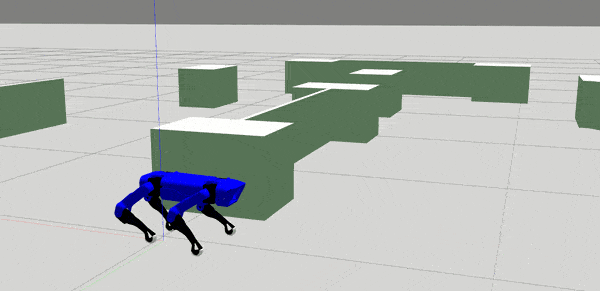
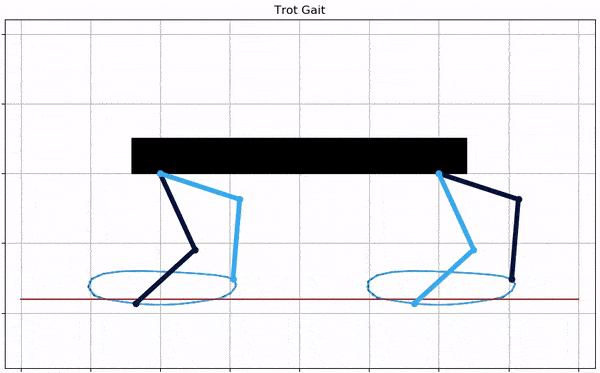
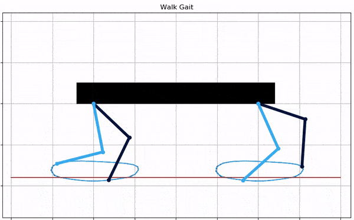
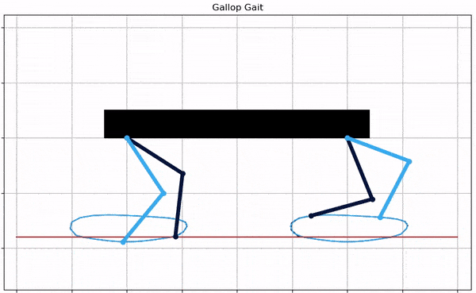
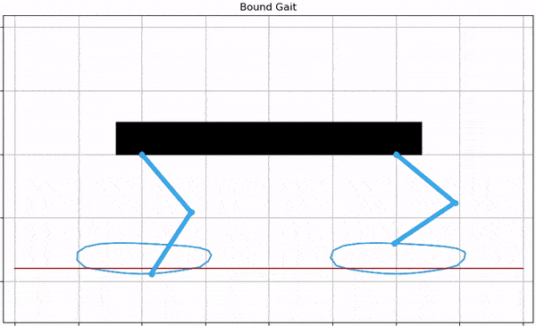
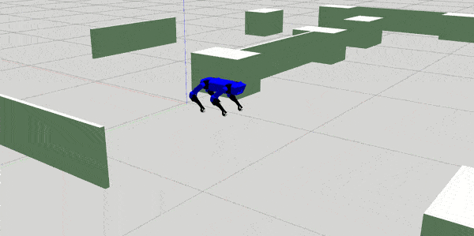
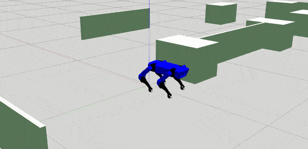
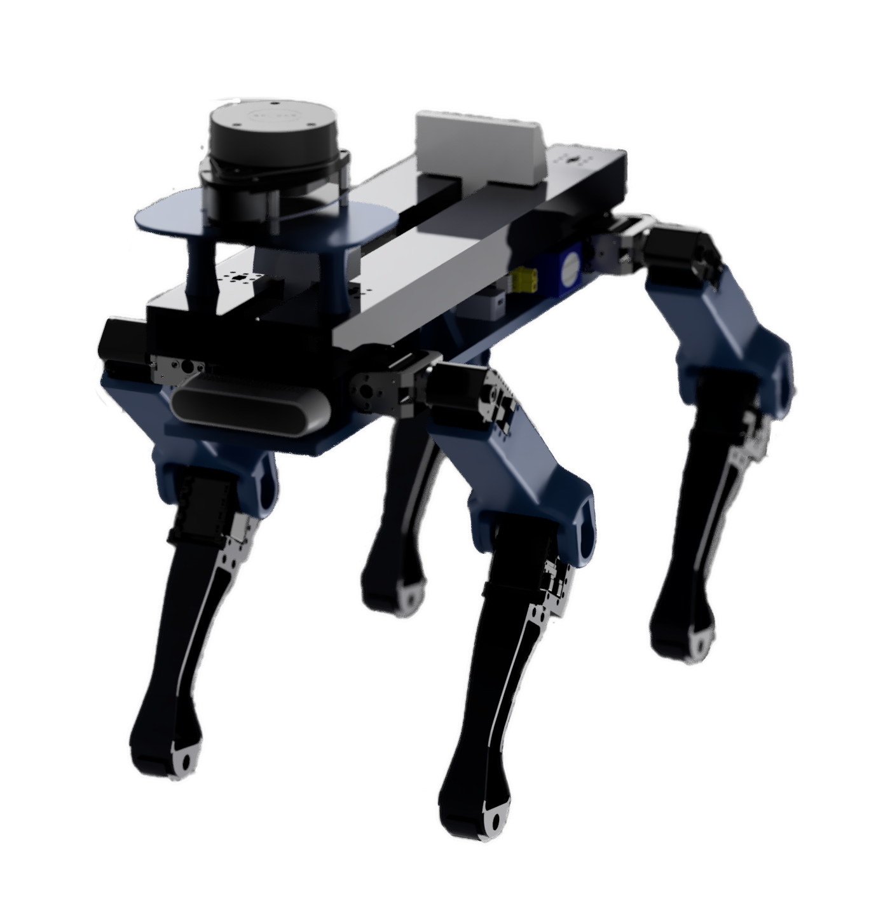

# DIPLOID -The Quadruped Robot

**DIPLOID is four-legged Quadruped robot inspired by the Boston Dynamics Spot and MIT Cheetah, being developed by Team Robocon BITS Pilani.
#make in India**
Started in early 2019 as a long-term project with an aim to achieve stable walking on rough terrain and environment perception using SLAM technique. 
Jump to:

* [Motivation](#Motivation)
* [Overview](#Overview)
* [Kinematics](#Kinematics)
* [Gait](#Gait)
* [Simulation](#Simulation)
* [Chassis and Hardware](#Chassis-and-Hardware)
* [Future Goals](#Future-goals)
* [References](#References)
* [Special Thanks](#Special-Thanks)

## Motivation

Quadruped robots have several applications like last mile delivery, guiding robots for blind, security and surveillance, accessing hazardous enviornments, etc. Or maybe Elon Musk will populate Mars with an army of Quadrupeds...who knows?  ;)

> **"Robots will walk with us to the Future"**

The Quadruped robot community and research is growing everyday in different parts of the world. So far, there hasn't been a robust quadruped on an undergraduate level in India, and we on the journey of develpoing one. #MakeInIndia

### Overview

This project is the source code for DIPLOID quadruped, a 4 legged robot. The software is implemented on a Raspberry Pi. As of now we have achieved-
  - Gaits like- trot, walk, pace, gallop and turning
  - Gazebo simulation for testing gaits and RL

### Kinematics

Add kinematics algorithm here

### Gait

This is how various walking gaits look like in a simple 2D animation.

  
  

  
  

|  |  |
| ------ | ------ |
| **Light Blue** | Left legs |
| **Dark Blue :** | Right Legs |

Various gaits implemented so far.

### Simulation

Put sim stuff here

A trial simulation with pace gait

#### Chassis and Hardware
The design for legs is inspired from spot-micro robot CAD but has been modified to incorporate Dynamixel AX-12A servo actuators.

Hardware planned to be used:
- Raspberry Pi 4
- Jetson nano
- 3D LIDAR
- Intel Realsense
- Dynamixel AX-12A actuators
- IMU

### Future Goals
We are aiming for stable walking on uneven terrains, blind stair climbing capability and developing an autonomous motion planning feature of the robot to execute a simple task around a sensed 3D environment while avoiding obstacles or possiblities of imbalance on its own.

### References

* Original idea : [MIT Cheetah](https://www.youtube.com/watch?v=QZ1DaQgg3lE&ab_channel=MassachusettsInstituteofTechnology%28MIT%29) and [Spot by Boston Dynamics](https://www.bostondynamics.com/spot)
* High speed trot-running: Implementation of a hierarchical controller using proprioceptive impedance control on the [MIT Cheetah](https://dspace.mit.edu/handle/1721.1/98270)
* https://github.com/mike4192/spotMicro
* And of course Dillinger, open source with a [public repository][dill] on GitHub.

### Special Thanks

* Spot mini mini : authors - Maurice Rahme and Ian Abraham and Matthew Elwin and Todd Murphey [spotminimini2020github](https://github.com/moribots/spot_mini_mini)
* Spot Micro AI Community : https://spotmicroai.readthedocs.io/en/latest/

[//]: # (These are reference links used in the body of this note and get stripped out when the markdown processor does its job. There is no need to format nicely because it shouldn't be seen. Thanks SO - http://stackoverflow.com/questions/4823468/store-comments-in-markdown-syntax)

   [dill]: <https://github.com/joemccann/dillinger>
   [git-repo-url]: <https://github.com/joemccann/dillinger.git>
   
